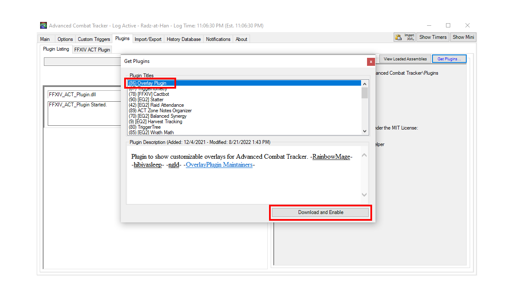
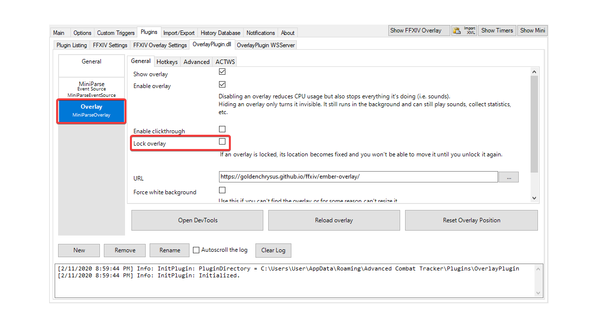

# FFXIV ACT Setup Guide

This guide is intended to get a FFXIV player setup with ACT and an overlay for parsing purposes and be able to upload logs to the FFLogs website.

*Last updated: 2/11/2020*

## Contents
- [Installing ACT](#installing-act)
- [Configuring ACT](#configuring-act)
  - [Running as Admin](#running-as-admin)
  - [Adding Firewall Exception](#adding-firewall-exception)
- [FFXIV ACT Plugin](#ffxiv-act-plugin)
- [OverlayPlugin](#overlayplugin)
  - [Preset Overlays](#preset-overlays)
  - [Custom Overlays](#custom-overlays)
- [Adding an Overlay](#adding-an-overlay)
- [FFLogs Uploader](#fflogs-uploader)

## Installing ACT

Navigate to the [ACT website](https://advancedcombattracker.com/), click on the **Download** page tab, then click on the `Advanced Combat Tracker - Setup` link to download the ACT installation program.

Find the `ACTv3-Setup` executable in your downloads and run it to begin the installation (If you get a User Account Control prompt, click yes).

The setup program will ask you for the installation location and start menu folder (You can leave the default options). Click **Install** then **Close** to complete the installation.

## Configuring ACT

### Running as Admin
It is recommended that ACT be run as Admin. You can right click on the ACT shortcut and select the **Run as administrator** option. You may get an UAC prompt, select yes.

You can also configure ACT to always run as admin by right clicking on the shortcut then selecting **Properties**. In the **Properties** window, select the **Compatibility** tab, then check the **Run this program as an administrator** option. Click **Apply** to save the changes. This will ensure ACT is always run as admin.

### Adding Firewall Exception
Open the windows **Control Panel** (you can search for control panel in the taskbar search bar). Select the **System and Security** category and under **Windows Defender Firewall** click on **Allow an app through Windows Firewall**. 

Inside the allowed apps window, click on **Change settings** button, then on the **Allow another app...** button. This will open up a dialog window to select an app.

Click on the **Browse...** button and navigate to the ACT install folder. The default location should be in `C:\Program Files (x86)\Advanced Combat Tracker`.

In the ACT folder, select the `Advanced Combat Tracker` application and click on **Open**.

Back in the dialog window, click on **Add** to add ACT to the windows firewall exceptions.

`Advanced Combat Tracker` should now appear in the list of **Allowed apps and features**. Click **OK** and exit the Control Panel.

## FFXIV ACT Plugin

Upon first running ACT, it will prompt you with the Startup Wizard. If you forget to download a parsing plugin, ACT will prompt you again the next time you run it, or you can manually open the wizard by going to **Options** > **Miscellaneous** > **Show Startup Wizard**.

In the **Parsing Plugin** section of the startup wizard, ensure `FFXIV Parsing Plugin` is selected from the dropdown, then click the `Download/Enable Plugin` button. You will receive an alert when the plugin has been added to ACT. Click **Ok** to dismiss it.

Click **Next** to move to the log file section. ACT will ask if it will be used for Final Fantasy XIV. Select **Yes** to configure ACT logs for FFXIV.

Click **Next** to move to Startup Settings, then **Close** to accept the default settings and finish the startup wizard.

At this point `FFXIV_ACT_Plugin.dll` should be enabled in **Plugins** > **Plugin Listing**.

## OverlayPlugin

From the **Plugin Listing** tab, click on the `Get Plugins...` button near the upper right corner. This will open a window that will populate with available plugins for ACT.

In the **Get Plugins** window, select the `[FFXIV+others]Overlay Plugin` option and click on `Download and Enable`. This will add the latest ngld **OverlayPlugin** to ACT (the OverlayPlugin auto-updater may also run during this step).

The OverlayPlugin should now be setup. Click on the `X` to close the **Get Plugins** window.

## Adding an Overlay

### Preset Overlays

Ngld's OverlayPlugin comes with built-in presets for a majority of popular overlays. To setup an overlay go to **Plugins** > **OverlayPlugin.dll** and click on the `New` button. 

This will open the **Create new overlay** dialog. Enter a **name** for the overlay and select a **preset** from the dropdown (the overlayplugin will show you a preview of each preset). Once you have selected your desired overlay, click on the **OK** button to add your overlay.

Your overlay should now appear in the overlays list. Select it from the list to view and edit its settings. You can move your overlay to the desired position, then check the **Lock overlay** box to lock it in place.

You can add additional overlays using the same steps. Certain plugins, e.g. cactbot plugin, will populate the preset dropdown with additional presets for their respective overlays.

### Custom Overlays

For an overlay not available in the presets, select the **Custom** option from the dropdown and the desired **Type**. For most overlays, it will be the **MiniParse** type.

In the overlay settings, make sure to add the overlay **URL** source. It can be a web url or the path to a local html file.

## FFLogs Uploader

